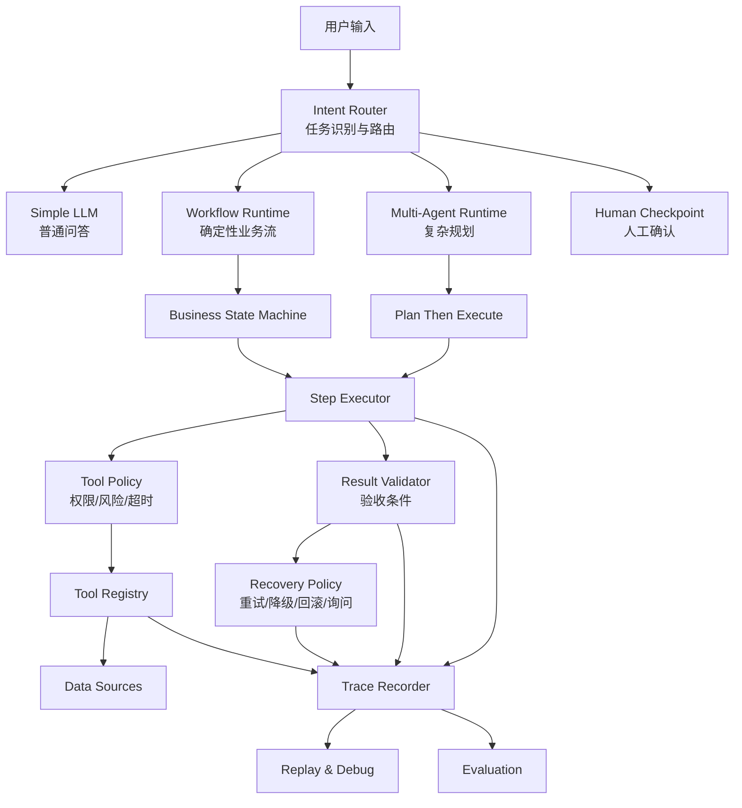

# 可解释、可观测、可恢复 Agent 系统演进规格文档

## 1. 背景

当前项目已经具备旅行规划 Agent 的基础形态：

- 有 `ConversationOrchestrator` 负责会话编排
- 有 `state-machine` 管理业务阶段
- 有 `TravelPlanningPipeline` 执行固定规划流程
- 有多个 Agent 分工处理交通、酒店、活动、预算
- 有 `ToolRegistry` 管理工具调用
- 有 `SessionLogger` 记录部分过程日志

但当前系统仍偏向“固定工作流 + 工具调用”，还没有形成完整的 Agent Runtime。目标是把它演进为一个能够解释决策、观察执行、失败恢复、可评测回放的 Agent 系统。

---

## 2. 目标

本次演进的核心目标是：

> 将当前旅行规划工作流升级为“可解释、可观测、可恢复”的 Agent Runtime，使系统能够明确判断任务类型、选择执行策略、约束工具权限、记录完整 trace，并在失败时按策略恢复。

### 成功标准

系统应能够回答以下问题：

- 为什么这次选择普通 LLM 回复，而不是工作流？
- 为什么需要多 Agent？
- 为什么调用了某个工具？
- 哪些节点必须用户确认？
- 某一步失败后，系统会重试、降级、跳过，还是询问用户？
- 最终输出是否满足业务约束？
- 任意一次会话是否可以通过 trace 回放和调试？

---

## 3. 非目标

本阶段不做以下事情：

- 不引入新的大模型供应商
- 不做真实支付、预订、下单能力
- 不重写整个业务系统
- 不把所有逻辑都交给 LLM 自主决定
- 不追求通用 Agent 平台，仍以旅行规划业务为主

---

## 4. 目标架构



---

## 5. 核心模块规格

### 5.1 Intent Router

新增 `Intent Router`，负责判断用户请求属于哪类任务。

任务类型建议分为：

- `simple_answer`：普通问答，一次 LLM 调用即可
- `slot_filling`：需要收集旅行字段
- `deterministic_workflow`：已有字段足够，直接走固定流程
- `multi_agent_planning`：复杂旅行规划，需要多个 Agent 协作
- `human_confirmation`：涉及用户选择、预算确认、不可逆操作
- `unsupported`：当前系统不支持

Router 输出结构：

```ts
interface RouteDecision {
  intent: string;
  executionMode: "simple_llm" | "workflow" | "multi_agent" | "human_confirm";
  confidence: number;
  reason: string;
  requiredFields: string[];
  humanCheckpoints: string[];
}
```

验收条件：

- 用户问“北京有什么好玩的”时，不应直接进入完整规划
- 用户说“帮我规划上海到北京三天预算1500”时，应进入工作流
- 用户说“就选第一个高铁和第二个酒店”时，应进入人工选择处理

---

### 5.2 Business State Machine

保留现有状态机，但要升级为业务状态定义中心。

状态必须显式声明：

- 当前状态名
- 允许转移的目标状态
- 进入状态需要的字段
- 离开状态的验收条件
- 失败恢复策略
- 是否需要人工确认

示例：

```ts
interface StateSpec {
  name: ConversationState;
  requiredFields: string[];
  exitCriteria: string[];
  allowedTransitions: ConversationState[];
  recoveryPolicy: RecoveryPolicy;
  requiresHumanConfirmation: boolean;
}
```

关键状态：

- `GATHERING_BASICS`
- `GATHERING_PREFERENCES`
- `SEARCHING_TRANSPORT`
- `SELECTING_TRANSPORT`
- `SEARCHING_HOTELS`
- `SELECTING_HOTEL`
- `PLANNING_ITINERARY`
- `VALIDATING_PLAN`
- `COMPLETED`
- `ERROR_RECOVERABLE`
- `ERROR_TERMINAL`

---

### 5.3 Step Executor

新增统一 Step Executor，不再让每个流程散落地调用工具或 Agent。

每一步执行都应有标准生命周期：

```text
pending -> running -> validating -> succeeded
                         ↓
                      failed -> recovering -> retrying / degraded / needs_user / terminal
```

每个 Step 必须定义：

```ts
interface AgentStep {
  id: string;
  name: string;
  inputSchema: object;
  outputSchema: object;
  execute: Function;
  validate: Function;
  timeoutMs: number;
  retryPolicy: RetryPolicy;
  recoveryPolicy: RecoveryPolicy;
}
```

---

### 5.4 Tool Policy

工具调用前必须经过权限判断。

工具风险等级：

- `safe_auto`：可自动调用，例如搜索景点
- `confirm_required`：需要用户确认，例如选择交通、酒店
- `sensitive`：涉及隐私、账号、费用
- `disabled`：当前不可用

工具元数据：

```ts
interface ToolMetadata {
  name: string;
  riskLevel: "safe_auto" | "confirm_required" | "sensitive" | "disabled";
  timeoutMs: number;
  maxRetries: number;
  costLevel: "free" | "paid" | "unknown";
  requiresNetwork: boolean;
  outputValidator: string;
}
```

验收条件：

- 搜索类工具可自动执行
- 选择交通、酒店必须保留用户确认
- 未来预订/支付类工具默认禁止自动执行

---

### 5.5 Result Validator

每个工具和 Agent 输出必须有验收条件。

例如交通搜索验收：

- 去程不为空
- 返程不为空
- 起点终点匹配
- 日期匹配
- 价格为正数
- 交通偏好一致或有解释
- 来源记录完整

最终计划验收：

- 日期覆盖完整
- 每天有活动
- 交通、酒店、活动价格进入预算计算
- 用户指定景点不能丢失
- 用户选择的交通/酒店不能被覆盖
- 超预算时必须说明原因或触发调整

---

### 5.6 Recovery Policy

失败不再只进入 `ERROR`，而是按类型恢复。

错误类型：

- `validation_error`
- `tool_timeout`
- `tool_empty_result`
- `tool_auth_error`
- `tool_rate_limit`
- `llm_parse_error`
- `low_confidence`
- `user_input_missing`

恢复动作：

- `retry_same`
- `retry_with_relaxed_constraints`
- `fallback_source`
- `ask_user`
- `skip_optional_step`
- `rollback_to_state`
- `terminal_error`

示例：

```text
酒店搜索为空
-> 放宽价格限制
-> 换 WebSearch
-> 仍为空则询问用户是否扩大区域/预算
```

---

## 6. 上下文工程规格

上下文分三层：

### 6.1 结构化状态

作为最可信上下文来源，保存：

- 目的地
- 出发地
- 日期
- 人数
- 预算
- 偏好
- 已确认交通
- 已确认酒店
- 当前状态
- 待确认事项

### 6.2 短期对话

只保留最近 N 轮原始消息，用于语言连续性。

### 6.3 压缩摘要

当会话过长时，将历史压缩为：

```ts
interface ConversationSummary {
  confirmedFacts: string[];
  userPreferences: string[];
  unresolvedQuestions: string[];
  rejectedOptions: string[];
  lastDecision: string;
}
```

LLM 输入必须由以下部分组成：

```text
System Prompt
+ 当前业务状态
+ 已确认字段
+ 待完成任务
+ 最近 N 轮对话
+ 可用工具
+ 工具权限说明
```

---

## 7. 可观测性规格

所有关键动作写入统一 trace。

Trace Event 格式：

```ts
interface TraceEvent {
  traceId: string;
  sessionId: string;
  stepId: string;
  parentStepId?: string;
  timestamp: string;
  actor: "user" | "router" | "llm" | "agent" | "tool" | "source" | "validator" | "recovery";
  action: string;
  stateBefore?: string;
  stateAfter?: string;
  input?: unknown;
  output?: unknown;
  error?: unknown;
  latencyMs?: number;
  decisionReason?: string;
}
```

必须记录：

- 用户输入
- router 决策
- 状态迁移
- LLM 请求/响应
- 工具调用
- 数据源调用
- 验收结果
- 失败恢复动作
- 用户确认节点
- 最终输出

---

## 8. 评测规格

评测分四层。

### 8.1 单元测试

覆盖：

- router 分类
- 状态迁移
- 工具 schema 校验
- result validator
- recovery policy

### 8.2 场景测试

典型场景：

- 普通问答不进入 pipeline
- 信息不完整时继续追问
- 高铁偏好必须优先高铁
- 用户选择交通后 pipeline 不覆盖选择
- 酒店为空时触发恢复
- 预算超支时触发调整

### 8.3 Trace 评测

检查一次执行是否符合预期路径：

```text
用户需求 -> router -> 状态机 -> 工具 -> 人工确认 -> pipeline -> validator -> completed
```

### 8.4 输出质量评测

用规则判断最终结果：

- 是否满足硬约束
- 是否引用了真实工具结果
- 是否遗漏用户指定偏好
- 是否预算一致
- 是否有不可解释推荐

---

## 9. 演进路线

### Phase 0：修复基础质量门禁

目标：让现有系统恢复可信基础。

任务：

- 修复测试失败
- 修复交通字段新旧协议不一致
- 修复 LLM URL 拼接问题
- 修复中文乱码
- 补齐 `.Codex/ARCHITECTURE.md`

验收：

- `npm run lint` 通过
- `npm test` 通过
- 关键旅行场景输出符合预期

---

### Phase 1：引入结构化决策层

目标：让系统知道“为什么走这个路径”。

任务：

- 新增 `IntentRouter`
- 新增 `RouteDecision`
- 在 trace 中记录 router 决策
- 将普通问答和完整旅行规划分流
- 明确 human checkpoint

验收：

- 简单问题不会进入完整 pipeline
- 复杂旅行需求会进入 workflow
- 选择交通/酒店必须等待用户确认

---

### Phase 2：统一 Step Runtime

目标：所有 Agent/工具步骤都有统一生命周期。

任务：

- 新增 `AgentStep`
- 新增 `StepExecutor`
- 把交通搜索、酒店搜索、pipeline 执行包装成 step
- 为 step 增加 timeout、retry、validate、recovery

验收：

- 每一步都有状态记录
- 任一步失败都能产生明确恢复动作
- 不再只有一个粗粒度 `ERROR`

---

### Phase 3：工具权限与验收体系

目标：工具调用安全、可控、可验证。

任务：

- 扩展 `ToolMetadata`
- 增加工具权限等级
- 增加工具输出 validator
- 为核心工具定义成功条件
- 工具失败返回标准错误类型

验收：

- 高风险工具不能自动执行
- 工具空结果不会被当作成功
- 工具错误能区分 timeout、auth、empty、parse

---

### Phase 4：上下文压缩与状态优先

目标：减少长对话上下文污染。

任务：

- 新增 `ConversationSummary`
- 设计上下文构造器
- 历史消息超过阈值后生成摘要
- LLM prompt 以结构化状态为主

验收：

- 长会话不会无限带完整历史
- 已确认字段不会被旧消息覆盖
- 用户拒绝过的选项不会再次推荐

---

### Phase 5：Trace、回放与调试

目标：每次执行可观察、可回放。

任务：

- 统一 `TraceEvent`
- 将 session log 升级为 trace log
- 增加 trace viewer 数据结构
- 支持按 session 回放状态变化和工具调用
- 保存关键 LLM 输入输出

验收：

- 任意会话能看到完整执行路径
- 能定位某个错误发生在哪一步
- 能解释最终推荐来自哪些工具结果

---

### Phase 6：评测集与质量门禁

目标：让 Agent 输出可持续验证。

任务：

- 建立核心旅行场景评测集
- 建立 router 评测集
- 建立 trace path 评测
- 建立最终计划规则评测
- CI 中加入质量门禁

验收：

- 每次改动自动验证核心场景
- 回归能被测试捕获
- 输出质量不只靠人工观察

---

## 10. 最终交付形态

完成后，系统应具备以下能力：

```text
用户输入
-> 判断任务类型
-> 选择执行模式
-> 明确是否需要人工确认
-> 执行结构化步骤
-> 调用受权限约束的工具
-> 校验每一步结果
-> 失败后按策略恢复
-> 记录完整 trace
-> 最终输出可评测、可解释、可回放
```

推荐实施顺序是：

```text
Phase 0 -> Phase 1 -> Phase 2 -> Phase 3 -> Phase 5 -> Phase 6 -> Phase 4
```

原因是：先修质量门禁，再加决策层和执行层；可观测性要尽早做，否则后续调试成本会越来越高。